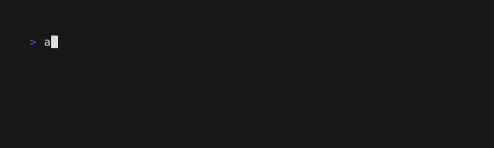
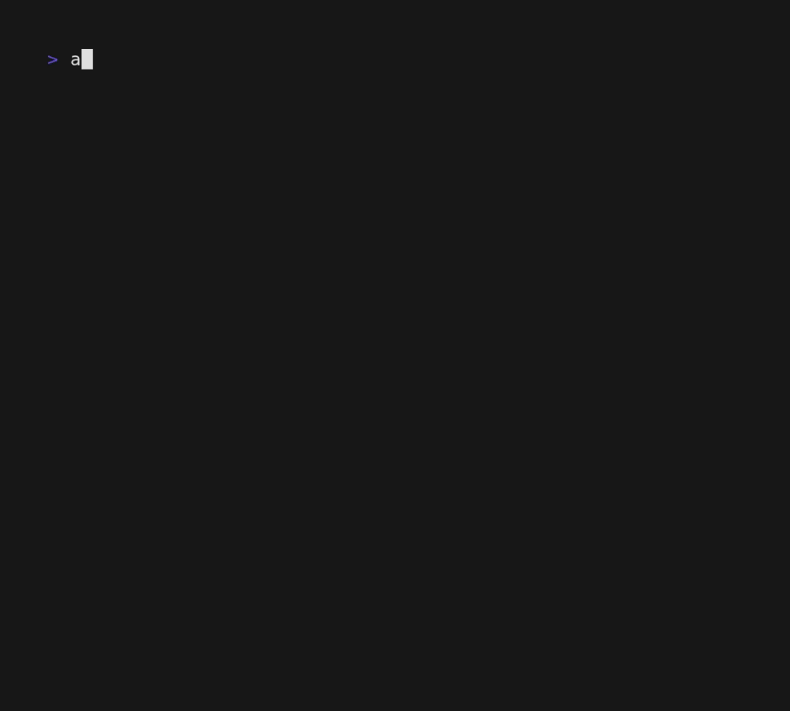

<p align="center">
	
</p>


<hr>


> perfection is finally attained not when there is no longer anything to add,
> but when there is no longer anything to take away
>
> Terre des Hommes (1939) - Antoine de Saint Exupéry

**attest** is a simple and modern test framework for CLI programs. There is no
exotic test syntax to remember, assertion API, plugins, or hidden lifecycle
methods to know about. Tests are just regular shell functions where every
statement is an assertion.

We already have all of the tools we need to write tests in the shell:

- Shell functions neatly organize tests into runnable units
- Need to compare text? `[` and `[[` have been around for decades
- Need to compare JSON? `jq -c` has you covered.
- Need some test setup/cleanup? Idiomatic with helper functions and traps.

By keeping the framework lightweight, tests are easy to write and quick to
understand, leading to an overall more effective testing experience.

## Writing tests

Here's an illustrative example of a test for the `md5sum` command:

```sh
## Test the md5sum command with known input/output
testHello() {
	result=$(echo hello | md5sum) # Test fails if nonzero exit

	[ "${result}" = "b1946ac92492d2347c6235b4d2611184  -" ] # Test fails if output changes
}
```

It looks like an ordinary shell script because it **is** an ordinary shell
script. You could even source it into your shell and run it directly if you
wanted to. Don't try that with Bats :).

There are only three implicit pieces of knowledge that you need for writing
tests:

- All test functions are named starting with `test`
- If any command in your function exits nonzero, the whole test fails
- Each test runs in a separate temporary directory

### Inline tests

If you're testing something that's itself a shell script, you can also include
your tests inline with the script.

<details>
<summary>For example:</summary>

```sh
#!/usr/bin/env bash

## Inline tests can be placed anywhere in the script. You can use $0 to call
## the script we're embedded in.

testGoodInput() {
	result=$($0 1 2)

	[ ${result} -eq 3 ]
}

testNoInput() {
	! $0
}

testBadInput() {
	! $0 1 1.2
}

testTooManyArgs() {
	! $0 1 2 3
}

# Here is the actual implementation of the script. It's not important for our
# purposes; I just prompted Claude for the most complicated way to add two
# numbers. The model calls it "enterprise grade" :)

python3 -c "
import subprocess, json, sys, os, tempfile, re

def validate(x):
  result = subprocess.run(
      ['bash', '-c', f'printf \"%d\" \"{x}\" 2>/dev/null || exit 1'],
      capture_output=True, text=True
  )
  if result.returncode != 0:
      raise ValueError(f'not an integer: {x}')
  return x

def add(a, b):
  validate(a)
  validate(b)

  with tempfile.NamedTemporaryFile(mode='w', suffix='.json', delete=False) as f:
      json.dump({'operands': [a, b], 'operation': 'addition'}, f)
      fname = f.name

  with open(fname) as f:
      payload = json.load(f)

  os.unlink(fname)

  result = subprocess.run(
      ['awk', '-v', f'a={payload[\"operands\"][0]}', '-v', f'b={payload[\"operands\"][1]}',
       'BEGIN { print a + b }'],
      capture_output=True, text=True
  )
  return result.stdout.strip()

if len(sys.argv) != 3:
  sys.exit(1)

try:
  print(add(sys.argv[1], sys.argv[2]))
except ValueError:
  sys.exit(1)
" "$1" "$2"
```

Inline tests can be nice because the closer the tests are to the code that's
being tested, the more likely they are maintained over time.

</details>

### Generating tests with AI

Tests are also easy for AIs to write. Use `attest skill` to print the a skill
which is pre-tuned to produce good tests. Here's an example prompt:

> Write attest-style tests for the `tac` command.

<details>
<summary>Here's the output from Haiku 4.5:</summary>

```sh
#!/usr/bin/env bash

## Basic functionality - reverse lines from a file
testBasicFile() {
	echo -e "line1\nline2\nline3" > input.txt
	result=$(tac input.txt)
	[ "$result" = "$(echo -e "line3\nline2\nline1")" ]
}

## Reverse lines from stdin
testStdin() {
	result=$(echo -e "first\nsecond\nthird" | tac)
	[ "$result" = "$(echo -e "third\nsecond\nfirst")" ]
}

## Single line should remain unchanged
testSingleLine() {
	echo "only line" > input.txt
	result=$(tac input.txt)
	[ "$result" = "only line" ]
}

## Empty file produces no output
testEmptyFile() {
	touch empty.txt
	result=$(tac empty.txt)
	[ -z "$result" ]
}

## Multiple files are concatenated and reversed
testMultipleFiles() {
	echo -e "a\nb" > file1.txt
	echo -e "c\nd" > file2.txt
	result=$(tac file1.txt file2.txt)
	[ "$result" = "$(echo -e "d\nc\nb\na")" ]
}

## Non-existent file produces error
testNonExistentFile() {
	! tac nonexistent.txt 2>/dev/null
}

## Trailing newline handling
testTrailingNewline() {
	printf "line1\nline2\nline3" > input.txt
	result=$(tac input.txt)
	[ "$result" = "$(echo -e "line3\nline2\nline1")" ]
}

## Help flag works
testHelp() {
	tac --help || tac -h
}

## Version flag works
testVersion() {
	tac --version || tac -v
}

## Lines with special characters
testSpecialCharacters() {
	echo -e "hello\$world\nfoo@bar\n#comment" > input.txt
	result=$(tac input.txt)
	echo "$result" | grep -q "^#comment"
	echo "$result" | grep -q "foo@bar"
}

## File with only whitespace lines
testWhitespaceLines() {
	printf "line1\n  \nline3\n" > input.txt
	result=$(tac input.txt)
	[ "$(echo "$result" | wc -l)" -eq 3 ]
}

## Very long lines are handled correctly
testLongLines() {
	long_line=$(printf 'a%.0s' {1..1000})
	echo -e "$long_line\nshort" > input.txt
	result=$(tac input.txt)
	echo "$result" | grep -q "^short$"
}

## Reads from multiple sources correctly
testMixedInput() {
	echo "file line" > file.txt
	echo "stdin line" | tac - file.txt | head -1 | grep -q "file line"
}
```

</details>

AI can generate tests all day, so the important thing is how easy it is for a
human to quickly understand and assess the quality of AI-produced tests.

## Running tests



Now that we have some tests, AI-generated or not, it's time for the good part.

```sh
# Just run the tests in one file
attest example.test

# Run all tests in this directory
attest .

# Tests run in parallel by default; use --parallel to limit concurrency
attest --parallel 1 .
```

Every test runs in a temporary _context directory_ that collects logs and
temporary files created by the test.

### Containerized tests

If your application requires some dependencies in a Docker container, you can
run `attest` in a container with this recipe:

```sh
docker run --rm -v $(which attest):/bin/attest -v $(pwd):/tests <image name> attest /tests
```

## Debugging tests


When a test fails, you can obtain the context directory:

```sh
attest . --save-context ./results
```

This directory contains everything: the test's xtrace, stdout, any files created
by the tests, etc.

You can also just view the xtrace output with the `--xtrace` flag:



## Installation

<details>
<summary>Crates.io</summary>


#### Install from crates.io

```sh
cargo install attest
```

</details>
